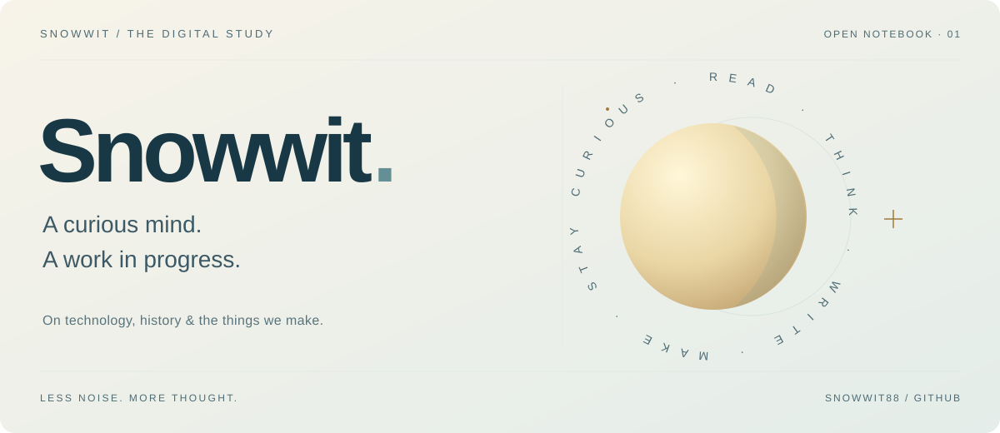

> **Effects preview** · The live profile is unchanged. Books and notes below are explicitly labeled examples.

<a href="./README.md">简体中文</a> &nbsp; / &nbsp; <a href="./README.en.md">English</a>

<picture><source media="(prefers-color-scheme: dark)" srcset="./assets/header-dark.svg" /><source media="(prefers-color-scheme: light)" srcset="./assets/header-light.svg" /></picture>

## About

### Hi, I'm Snowwit.

Two questions keep me curious: **how did the world become what it is today, and what could we make better?**

The first leads me to economic history, finance and writing. The second brings me to AI and automation. This is my digital study: a place for things I make and questions I am still thinking through.

## Making

WeChat Ink grew out of my own writing workflow. It brings writing, illustrations and formatting together, leaving more time for research, judgment and expression.

[Explore the project ↗](https://github.com/Snowwit88/wechat-ink) · [Get started ↗](https://github.com/Snowwit88/wechat-ink/blob/main/GETTING_STARTED.md)

## Reading room

Sample shelves only. No actual books or reading claims have been added.

<b>01 / History &amp; institutions</b>

Book: to be added. A question: how did today's familiar rules take shape?

<b>02 / Technology &amp; everyday life</b>

Book: to be added. A question: whose daily life does a new tool change?

<b>03 / Writing &amp; expression</b>

Book: to be added. A question: how can clarity leave room for complexity?

## Field notes

<!-- ARTICLES:START -->
Layout examples, not published articles. Configure an RSS / Atom source to show the three most recent entries.

- [Making room for curiosity · demo note (Chinese)](./content/note-curiosity.md)
- [What do tools save us? · demo note (Chinese)](./content/note-tools.md)
- [Writing down a question · demo note (Chinese)](./content/note-questions.md)
<!-- ARTICLES:END -->

## Small steps

Real public calendar data, captured at generation time. Daily updates become active when the workflow is adopted on the default branch.

---

<samp>READ. THINK. MAKE. REPEAT.</samp>

[Preview checklist](./PREVIEW.md)
