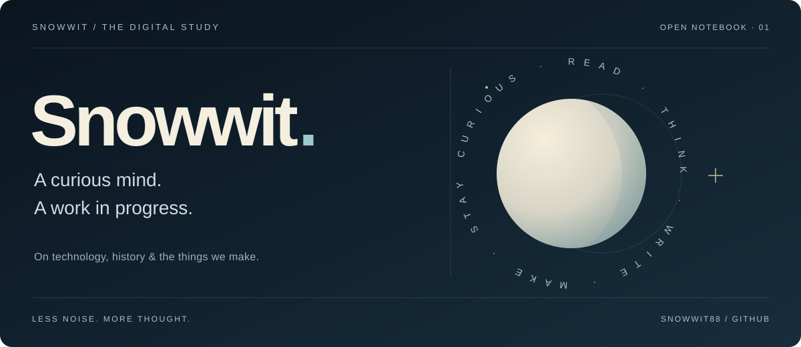

> **效果试用版** · 此页用于挑选功能，当前个人主页保持原样。书架与文章内容为明确标注的排版示例。

<a href="./README.md">简体中文</a> &nbsp; / &nbsp; <a href="./README.en.md">English</a>

<picture>
  <source media="(prefers-color-scheme: dark)" srcset="./assets/header-dark.svg" />
  <source media="(prefers-color-scheme: light)" srcset="./assets/header-light.svg" />
  
</picture>

<samp><a href="#about">ABOUT</a> &nbsp; / &nbsp; <a href="#making">MAKING</a> &nbsp; / &nbsp; <a href="#reading-room">READING</a> &nbsp; / &nbsp; <a href="#field-notes">NOTES</a></samp>

☀ 昼 / ☾ 夜 · 展开对比两套封面

**昼 · 纸白与浅金**

**夜 · 深蓝与月光**

 

## About

### 你好，我是 Snowwit。

我对两类问题很感兴趣：**世界为什么变成今天这样，以及我们还能把什么做得更好。**

前一个问题把我带向经济史、金融演化和写作；后一个问题让我开始折腾 AI 和自动化工具。这里是我的数字书房，放一些做出来的东西，也留下一些还没想明白的问题。

**阅读过去** · 理解技术、制度与普通人的生活。  
**写下思考** · 把复杂的事说明白，给判断留下余地。  
**动手试试** · 从日常问题出发，做一个能用的小工具。

 

## Making

从自己的公众号写作流程出发，整理出一套写作、配图与排版工具。让重复步骤少一点，把时间留给查证、判断和表达。

[查看项目 ↗](https://github.com/Snowwit88/wechat-ink) &nbsp; [开始使用 ↗](https://github.com/Snowwit88/wechat-ink/blob/main/GETTING_STARTED.md)

 

## Reading room

示例书架 · 尚未填入真实书单，不代表已读或推荐。

<b>01 / 历史与制度</b> — 点击打开书架

| 书籍 | 阅读状态 | 留给自己的问题 |
| :--- | :--- | :--- |
| 书名待补充 | 待填写 | 今天习以为常的规则，是怎样形成的？ |

<b>02 / 技术与生活</b> — 点击打开书架

| 书籍 | 阅读状态 | 留给自己的问题 |
| :--- | :--- | :--- |
| 书名待补充 | 待填写 | 一个新工具，到底改变了谁的日常？ |

<b>03 / 写作与表达</b> — 点击打开书架

| 书籍 | 阅读状态 | 留给自己的问题 |
| :--- | :--- | :--- |
| 书名待补充 | 待填写 | 怎样既讲得清楚，也保留复杂性？ |

 

## Field notes

<!-- ARTICLES:START -->
排版示例 · 以下为本次预览的演示笔记，不是已发表文章。接入 RSS / Atom 后，此处自动显示最新三篇。

- [01 / 留一点时间给好奇心 · 示例](./content/note-curiosity.md)
- [02 / 工具替我们省下了什么 · 示例](./content/note-tools.md)
- [03 / 把问题写下来 · 示例](./content/note-questions.md)
<!-- ARTICLES:END -->

 

## Small steps

数据来自 GitHub 公开贡献日历。预览为生成时的快照；每日刷新工作流待选用后随主分支启用。

 

<b>给自己的几句提醒</b>

- 先做一个能用的小东西，再决定它应该长多大。
- 分清查到的事实、自己的推测和暂时不知道的部分。
- 工具可以帮忙，判断不能省略。
- 允许作品更新，也允许自己改变看法。

---

<samp>READ. THINK. MAKE. REPEAT.</samp>  很高兴你路过这里。关于微墨的想法，欢迎在 <a href="https://github.com/Snowwit88/wechat-ink/issues">Issues</a> 留言。

[预览说明与各项效果清单](./PREVIEW.md)
